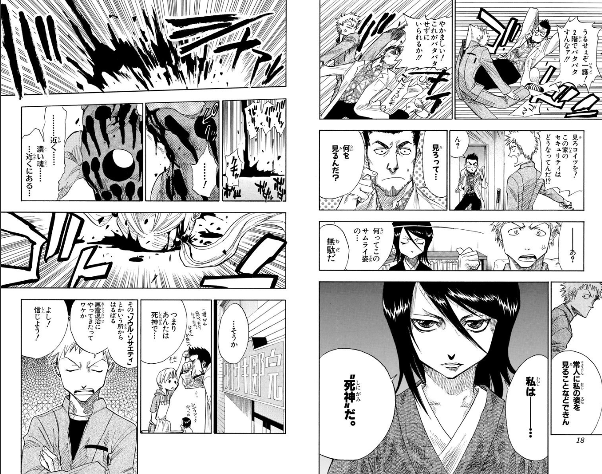
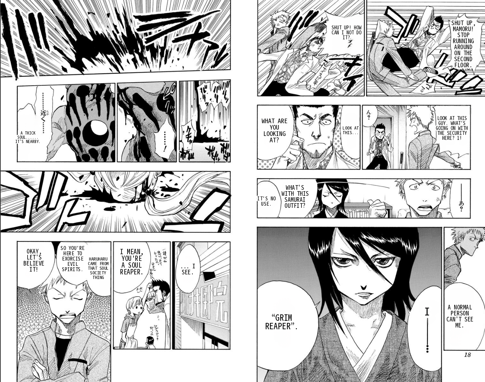

# MangaTL

Translate manga pages from Japanese to English using AI. Point it at a folder, get clean readable translations back.

> **No account needed:** Use `sugoi` — fully offline, no API key, no sign-up required.  
> **Free API:** DeepL free tier — 500k characters/month, no credit card.  
> **Best quality:** GPT-4o (`-t chatgpt`) or Gemini (`-t gemini`) for natural, context-aware translations.

---

## Examples

| Original | Translated |
|:---:|:---:|
|  |  |
|  |  |
|  |  |

---

## Features

- Translates entire manga volumes in one command
- Ensemble text detection (deep learning + CV fallback)
- Bubble-aware text rendering with auto-sizing
- Clean text inpainting (LAMA)
- Multiple backends: DeepL, GPT-4o, Gemini, offline models
- GPU accelerated

---

## Requirements

- Python 3.10+
- CUDA GPU (recommended) or CPU
- ~4GB disk space for models

---

## Installation

### 1. Clone the repository

```bash
git clone --recurse-submodules https://github.com/momoyash/manga-translator.git
cd manga-translator
```

> **Note:** The `--recurse-submodules` flag is required to pull in the translation engine (`tl-core`). If you already cloned without it, run `git submodule update --init --recursive` inside the repo.

### 2. Run setup

**Windows:**
```bash
setup.bat
```

**Mac/Linux:**
```bash
bash setup.sh
```

This installs all dependencies (the engine is already bundled in `tl-core/`).

### 3. Download bubble detector

Download `detector.onnx` from [comic-text-and-bubble-detector](https://huggingface.co/ogkalu/comic-text-and-bubble-detector) and place it in:

```
manga-translator/models/detector.onnx
```

### 4. Add API keys (optional)

Create `.env` in the project root:

```env
DEEPL_AUTH_KEY=your_key
OPENAI_API_KEY=your_key
GEMINI_API_KEY=your_key
```

---

## Usage

### Basic

```bash
# Translate a folder
python run.py -i manga_folder/ -o output/

# Translate single image
python run.py -i page.png -o output/
```

### Choose translator

```bash
python run.py -i manga/ -o out/ -t sugoi      # Offline — no API key needed ✓
python run.py -i manga/ -o out/ -t deepl      # DeepL (free tier, better quality)
python run.py -i manga/ -o out/ -t chatgpt    # GPT-4o (best quality)
python run.py -i manga/ -o out/ -t gemini     # Gemini (free tier)
```

### Other options

```bash
python run.py -i manga/ -o out/ --lang DEU    # German output
python run.py -i manga/ -o out/ -f jpg        # JPG format
python run.py -i manga/ -o out/ --no-gpu      # CPU only
python run.py -i manga/ -o out/ --clip        # Clip overflow text
python run.py --list                          # List translators
```

---

## Project Structure

```
manga-translator/
├── run.py              # Main entry point
├── settings.json       # Configuration
├── mtl/                # Core modules
│   ├── detector.py     # Bubble detection
│   └── renderer.py     # Text rendering helpers
├── models/             # detector.onnx goes here
├── tl-core/            # Translation engine (auto-installed)
└── assets/examples/    # Example images
```

---

## Configuration

Edit `settings.json`:

```json
{
  "translator": {
    "translator": "deepl",
    "target_lang": "ENG"
  },
  "detector": {
    "detector": "ensemble",
    "detection_size": 2048,
    "text_threshold": 0.25
  },
  "render": {
    "renderer": "manga2eng_pillow",
    "font_size_offset": -3,
    "uppercase": true
  },
  "inpainter": {
    "inpainter": "lama_large",
    "inpainting_size": 2048
  }
}
```

### Key settings

| Setting | Description |
|---------|-------------|
| `font_size_offset` | Adjust text size (-3 = smaller, fits better) |
| `text_threshold` | Detection sensitivity (0.25 = more bubbles) |
| `uppercase` | Use uppercase text (manga style) |

---

## Translators

| Name | Type | Notes |
|------|------|-------|
| `deepl` | API | 500k chars/month free, great quality |
| `chatgpt` | API | GPT-4o, best natural English |
| `gemini` | API | Free tier available |
| `deepseek` | API | Cheap, solid quality |
| `groq` | API | Fast, free tier |
| `sugoi` | Offline | JP→EN, no API needed |
| `m2m100` | Offline | Multilingual |
| `nllb` | Offline | Meta multilingual |

---

## Troubleshooting

**"Engine missing" error**  
Run `setup.bat` or `setup.sh` to install the engine.

**GPU not detected**  
Install CUDA and matching PyTorch version.

**Text overflows bubbles**  
Set `font_size_offset` to a negative value in settings.json.

**Missing translations**  
Lower `text_threshold` in settings.json to detect more text.

---

## Credits

Built on top of **[manga-image-translator](https://github.com/zyddnys/manga-image-translator)** by [zyddnys](https://github.com/zyddnys) — the core translation engine that makes all of this possible.

Also uses:
- [comic-text-and-bubble-detector](https://huggingface.co/ogkalu/comic-text-and-bubble-detector) by ogkalu — bubble detection model
- [LAMA](https://github.com/saic-mdal/lama) — inpainting model

---

## License

MIT License
